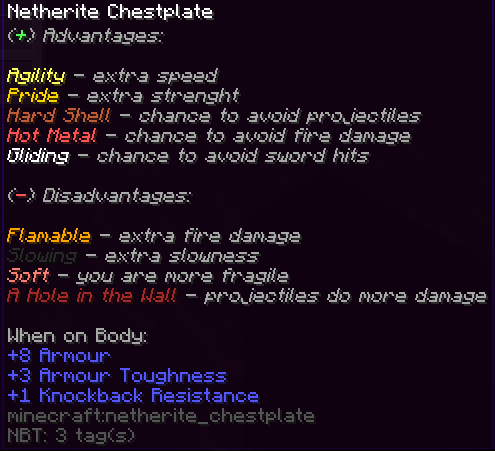
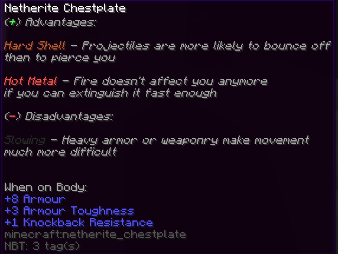

# About
## What is ItemForge
ItemForge is a complete overhaul of a minecraft combat system.
Or something like that, cause rn this
is still an alpha version.
With this plugin, I wanted to alter the way players fight, add some randomness
and overall make combat more interesting.

## TODO LIST
- [x] Alter Damage Calculation
- [ ] Crafting additions and changes
- [ ] Smithing
- [ ] New Weapons
- [ ] Wiki

# Features

## Damage Calculation
Currently, the damage done by weapons is only manipulated by its durability.
If there is, for example, only 20% left, the damage will be reduced by 40%.
This calculation is actually
fully customizable in the `config.yml`

## Crafting Additions
You are now able to craft chainmail armor using chains

## Custom Item Attributes
Currently only working for armors

This adds multiple custom attributes to armors and tools, changing the experience you
have using those items. There will be at least one negative and positive Attribute applied to every
armor piece. Which armor pieces can get which attribute has to be defined in the config. 
Below you can find the current attributes, there will be more soon.

Advantages:
- `Agility` | Makes you faster
- `Pride` | Gives you strenght
- `Hard Shell` | Provides a chance that projectiles bounce off you
- `Hot Metal` | You are immune to fire for a customizable amount with a cooldown limiting this ability
- `Gliding` | Swords have a chance to not hit you

Disadvantages:
- `Flamable` | You take more fire damage
- `Slowing` | Slows you down
- `Soft` | (Still WIP)
- `A Hole in the Wall` | Projectiles do more damage

Example for attribute lore on items:
---

### Current Config

## Debugging Features
There are currently two different commands that help with debugging,
`/debuginfo` and `setitemdurability`.

| command           | args             | Permission                        | Features                                                                                |
|-------------------|------------------|-----------------------------------|-----------------------------------------------------------------------------------------|
| debuginfo         | show_damage_info | itemforge.debug.show_damage_info  | shows you various information like your current damage                                  |
| setitemdurability | none             | itemforge.debug.setitemdurability | pretty self explanatory (if no number is put in shows you the items current durability) |

> [!IMPORTANT]
> This is still an alpha if not a pre-alpha, so don't expect too much
